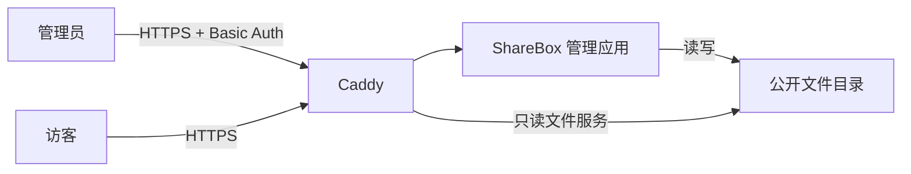

# ShareBox

ShareBox 是一个面向个人服务器的轻量文件管理与分享工具。管理员通过 React Router 管理页面上传、浏览和删除文件；公开文件可由 Caddy 直接提供目录浏览与下载。

当前仓库处于第一版开发阶段，重点是建立可用的管理界面和安全的本地文件树操作。产品边界见 [需求文档](docs/requirements.md)，目标部署方案见 [架构设计](docs/architecture.md)。

## 当前功能

- 在同一工作区浏览文件树和上传文件
- 展开、收起多级目录，支持鼠标与键盘操作
- 显示文件类型图标、文件大小和目录子项数量
- 选择或拖放单个文件并显示上传状态
- 删除文件和空目录，操作前显示确认对话框
- 上传、删除或手动刷新后重新读取磁盘文件树
- 忽略符号链接，并限制删除目标位于配置的数据目录内
- 未捕获的路由和渲染异常通过全局弹窗提示，并支持重新加载
- 使用 MUI 组件、图标和响应式双栏布局

当前上传会将文件一次性读入内存，同名文件会被覆盖。因此本实现还不适合直接处理不受信任的上传或超大文件。流式临时写入、原子发布、同名拒绝、新建目录、重命名、移动及复制公开链接仍属于后续工作。

## 技术栈

- Node.js、TypeScript
- React 19
- React Router Framework（SSR、loader/action、fetcher）
- Material UI 与 MUI X Tree View
- Pino 结构化日志
- Vite

## 快速开始

### 环境要求

- Node.js 22.22.0 或更高版本
- npm
- 一个已经存在、且当前用户可读写的数据目录

### 安装与运行

```bash
npm ci
mkdir -p ./data
DATA_DIR="$PWD/data" npm run dev
```

开发服务器默认可通过 `http://localhost:5173` 访问。`DATA_DIR` 是必填的绝对或相对路径；应用启动时会检查该路径是否存在且为目录。

可以先创建少量测试内容来查看多级文件树：

```bash
mkdir -p ./data/documents
printf 'Hello ShareBox\n' > ./data/documents/example.txt
```

## 常用命令

| 命令 | 用途 |
| --- | --- |
| `npm run dev` | 启动带热更新的开发服务器 |
| `npm test` | 运行服务端单元测试 |
| `npm run typecheck` | 生成路由类型并运行 TypeScript 检查 |
| `npm run build` | 构建客户端和 SSR 服务端产物 |
| `npm run start` | 运行 `build/server/index.js` 生产构建 |
| `scripts/build_source.sh` | 重新安装依赖、构建并生成发布压缩包 |
| `scripts/deploy_server.sh <包>` | 在 Linux 服务器部署或更新生产包（需要 root） |

生产构建与运行示例：

```bash
npm ci
npm run typecheck
npm run build
DATA_DIR=/srv/sharebox/public npm run start
```

构建输出位于 `build/`：

```text
build/
├── client/   # 浏览器静态资源
└── server/   # Node.js SSR 服务
```

在项目 `.env` 中配置允许提交 action 的管理端主机名：

```dotenv
USER_URL=管理端域名
```

直接运行打包脚本即可：

```bash
scripts/build_source.sh
```

脚本只负责检查 `.env` 中的 `USER_URL` 已写入生产构建，并在 `dist/` 下生成 `sharebox-<version>.tar.gz`，其中包含 `build/`、`package.json` 和 `package-lock.json`。

### 服务器部署

部署脚本默认创建或复用无登录系统用户 `sharebox`，将程序安装到 `/var/lib/sharebox/app`，将持久文件保存在 `/var/lib/sharebox/data`，并创建、启用和启动 `sharebox.service`：

```bash
sudo scripts/deploy_server.sh dist/sharebox-<version>.tar.gz
```

压缩包必须已经从 `.env` 写入允许提交 action 的主机名。部署脚本只检查构建产物中的 `allowedActionOrigins` 非空，不再要求输入域名。

重复运行会完整替换程序目录，因此旧版本遗留文件不会保留；`/var/lib/sharebox/data` 始终保留。脚本先在临时目录安装生产依赖，切换版本后再启动服务；如果新服务启动失败，会恢复原程序和原 systemd unit。旧的 `/srv/share` 数据不会自动迁移，应在首次部署前单独复制并核对。

默认生成的 unit 等价于：

```ini
[Service]
User=sharebox
Group=sharebox
WorkingDirectory=/var/lib/sharebox/app
Environment=HOST=127.0.0.1
Environment=PORT=8123
Environment=DATA_DIR=/var/lib/sharebox/data
ExecStart=/usr/bin/node /var/lib/sharebox/app/node_modules/@react-router/serve/dist/cli.js /var/lib/sharebox/app/build/server/index.js
```

可通过 `SHAREBOX_USER`、`SHAREBOX_GROUP`、`SHAREBOX_STATE_DIR`、`SHAREBOX_HOST`、`SHAREBOX_PORT` 和 `SHAREBOX_SERVICE_NAME` 覆盖默认值。为避免误删，程序目录固定为 `<SHAREBOX_STATE_DIR>/app`，数据目录固定为 `<SHAREBOX_STATE_DIR>/data`。

## 配置

| 配置 | 必填 | 说明 |
| --- | --- | --- |
| `DATA_DIR` | 是 | ShareBox 浏览和修改的文件根目录；目录必须在启动前创建 |
| `LOGGER_LEVEL` | 否 | Pino 日志级别，默认 `info` |

应用以 JSON Lines 格式将启动、文件列表读取、上传、删除和相关错误日志直接写入标准输出，不创建日志文件。生产环境可由 systemd、容器运行时或其他进程管理器负责采集和保留日志。

React Router 从 `.env` 的 `USER_URL` 读取并构建允许提交 action 的主机名。修改管理域名后必须重新构建发布包。

## 项目结构

```text
app/
├── components/
│   ├── files/       # 文件浏览卡片、树节点和删除交互
│   ├── layout/      # 管理工作区页面布局
│   └── upload/      # 上传面板和拖放选择区
├── routes/          # React Router 路由、loader 和 action 入口
├── server/          # 文件系统操作、表单处理与运行配置
├── types/           # 前后端共享类型
├── utils/           # 通用格式化函数
├── root.tsx         # HTML 文档、主题 Provider 和错误边界
└── theme.ts         # MUI 主题
```

页面 loader 从磁盘读取文件树；上传和删除通过 fetcher 提交给路由 action，成功后 React Router 自动重新验证 loader。更细的文件职责见 [代码结构说明](docs/code-structure.md)。

## 部署思路

目标部署由 Caddy 和 ShareBox 管理应用组成：



建议仅让 Node.js 服务监听本机地址，由 Caddy 负责 HTTPS、管理端 Basic Auth、反向代理以及公开文件下载。不要把配置、密码、日志、临时文件或备份放入 `DATA_DIR`。部署脚本会生成 systemd unit；仓库目前没有可直接使用的 Caddyfile 或容器镜像，部署前请根据 [架构设计](docs/architecture.md) 补齐并验证这些配置。

## 已知限制

- 仅支持向根目录上传单个文件
- 同名上传会覆盖现有文件
- 上传使用内存缓冲，未实现大小限制、临时文件和原子发布
- 只能删除文件或空目录
- 尚未实现新建目录、重命名、移动和复制公开链接
- 应用自身不提供认证，正式部署必须在反向代理层保护所有管理页面和写操作
- 文件列表直接来自磁盘，没有数据库、搜索、标签、预览或审计记录

## 文档

- [产品需求](docs/requirements.md)
- [架构设计](docs/architecture.md)
- [代码结构](docs/code-structure.md)
