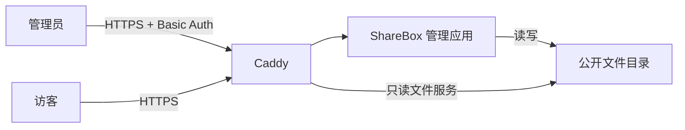

# ShareBox

ShareBox 是一个面向个人服务器的轻量文件管理与分享工具。管理员通过 React Router 管理页面上传、浏览和删除文件；公开文件可由 Caddy 直接提供目录浏览与下载。

当前仓库处于第一版开发阶段，重点是建立可用的管理界面和安全的本地文件树操作。产品边界见 [需求文档](docs/requirements.md)，目标部署方案见 [架构设计](docs/architecture.md)。

## 当前功能

- 在同一工作区浏览文件树和上传文件
- 展开、收起多级目录，支持鼠标与键盘操作
- 显示文件类型图标、文件大小和目录子项数量
- 选择或拖放多个文件，使用 tus 续传，显示每个文件的字节数与百分比
- 支持暂停、继续、失败重试和删除上传任务；刷新后重新选择原文件可续传
- 删除文件和空目录，操作前显示确认对话框
- 上传、删除或手动刷新后重新读取磁盘文件树
- 忽略符号链接，并限制删除目标位于配置的数据目录内
- 未捕获的路由和渲染异常通过全局弹窗提示，并支持重新加载
- 使用 MUI 组件、图标和响应式双栏布局

上传使用 `tus-js-client`、`@tus/server` 和 `@tus/file-store`，每个请求最多发送 8 MiB，数据流式写入公开目录之外。完成传输后单独请求复制发布，发布成功才显示“上传成功”；复制期间可能公开不完整内容，进程被强制终止时可能留下残缺文件。同名文件、目录和符号链接均拒绝覆盖。新建目录、重命名、移动及复制公开链接不属于当前版本。

上传任务和断点保存在 `UPLOAD_TMP_DIR/tus`，发布回执保存在 `UPLOAD_TMP_DIR/tus-receipts`；任务从创建起保留 7 天，首次使用上传服务时及其后每小时清理过期数据。发布失败保留完整临时文件供重试。暂停保留断点，“删除上传”清理临时数据，“移除记录”仅移除已完成的界面记录，不删除公开文件。浏览器记录不保存文件内容，刷新后通常需要重新选择同名、同大小且修改时间一致的原文件。

## 技术栈

- Node.js、TypeScript
- React 19
- React Router Framework（SSR、loader/action、fetcher）
- Material UI 与 MUI X Tree View
- Pino 结构化日志
- Vite

## 快速开始

### 环境要求

- Node.js 22.22.0 或更高版本
- npm
- 一个已经存在、且当前用户可读写的数据目录

### 安装与运行

```bash
npm ci
mkdir -p ./data
DATA_DIR="$PWD/data" npm run dev
```

开发服务器默认可通过 `http://localhost:5173` 访问。`DATA_DIR` 是必填的绝对或相对路径；应用启动时会检查该路径是否存在且为非符号链接目录。上传临时目录默认是数据目录真实路径加 `.tmp`，应用需有创建和写入权限，也可通过 `UPLOAD_TMP_DIR` 指定独立目录（支持跨文件系统）。

可以先创建少量测试内容来查看多级文件树：

```bash
mkdir -p ./data/documents
printf 'Hello ShareBox\n' > ./data/documents/example.txt
```

## 常用命令

| 命令 | 用途 |
| --- | --- |
| `npm run dev` | 启动带热更新的开发服务器 |
| `npm test` | 运行服务端与上传队列回归测试 |
| `npm run typecheck` | 生成路由类型并运行 TypeScript 检查 |
| `npm run build` | 构建客户端和 SSR 服务端产物 |
| `npm run start` | 运行 `build/server/index.js` 生产构建 |
| `scripts/build_source.sh` | 重新安装依赖、构建并生成发布压缩包 |
| `scripts/deploy_server.sh <包>` | 在 Linux 服务器部署或更新生产包（需要 root） |

生产构建与运行示例：

```bash
npm ci
npm run typecheck
npm run build
DATA_DIR=/srv/sharebox/public npm run start
```

构建输出位于 `build/`：

```text
build/
├── client/   # 浏览器静态资源
└── server/   # Node.js SSR 服务
```

在项目 `.env` 中配置允许提交 action 的管理端主机名：

```dotenv
USER_URL=管理端域名
```

直接运行打包脚本即可：

```bash
scripts/build_source.sh
```

脚本只负责检查 `.env` 中的 `USER_URL` 已写入生产构建，并在 `dist/` 下生成 `sharebox-<version>.tar.gz`，其中包含 `build/`、`package.json` 和 `package-lock.json`。

### 服务器部署

部署脚本默认创建或复用无登录系统用户 `sharebox`，将程序安装到 `/var/lib/sharebox/app`，将持久文件保存在 `/var/lib/sharebox/data`，并创建、启用和启动 `sharebox.service`。`/var/lib/sharebox` 和数据目录归 `sharebox:sharebox` 所有，目录权限为 `0755`；数据文件权限为 `0644`，可供 Caddy 等其他用户读取：

```bash
sudo scripts/deploy_server.sh dist/sharebox-<version>.tar.gz
```

压缩包必须已经从 `.env` 写入允许提交 action 的主机名。部署脚本只检查构建产物中的 `allowedActionOrigins` 非空，不再要求输入域名。

重复运行会完整替换程序目录，因此旧版本遗留文件不会保留；`/var/lib/sharebox/data` 始终保留。脚本先在临时目录安装生产依赖，切换版本后再启动服务；如果新服务启动失败，会恢复原程序和原 systemd unit。旧的 `/srv/share` 数据不会自动迁移，应在首次部署前单独复制并核对。

默认生成的 unit 等价于：

```ini
[Service]
User=sharebox
Group=sharebox
WorkingDirectory=/var/lib/sharebox/app
Environment=HOST=127.0.0.1
Environment=PORT=8123
Environment=DATA_DIR=/var/lib/sharebox/data
Environment=UPLOAD_TMP_DIR=/var/lib/sharebox/tmp
Environment=MAX_UPLOAD_BYTES=10737418240
ExecStart=/usr/bin/node /var/lib/sharebox/app/node_modules/@react-router/serve/dist/cli.js /var/lib/sharebox/app/build/server/index.js
UMask=0022
```

可通过 `SHAREBOX_USER`、`SHAREBOX_GROUP`、`SHAREBOX_STATE_DIR`、`SHAREBOX_HOST`、`SHAREBOX_PORT` 、`SHAREBOX_MAX_UPLOAD_BYTES` 和 `SHAREBOX_SERVICE_NAME` 覆盖默认值。为避免误删，程序目录固定为 `<SHAREBOX_STATE_DIR>/app`，数据目录固定为 `<SHAREBOX_STATE_DIR>/data`。

## 配置

| 配置 | 必填 | 说明 |
| --- | --- | --- |
| `DATA_DIR` | 是 | ShareBox 浏览和修改的文件根目录；目录必须在启动前创建 |
| `UPLOAD_TMP_DIR` | 否 | 私有上传临时目录，默认 `<DATA_DIR 的真实路径>.tmp`，不得与公开目录重叠，支持跨文件系统 |
| `MAX_UPLOAD_BYTES` | 否 | 单文件大小上限，默认 `10737418240`（10 GiB），必须为正安全整数 |
| `LOGGER_LEVEL` | 否 | Pino 日志级别，默认 `info` |

应用以 JSON Lines 格式将启动、文件列表读取、上传、删除和相关错误日志直接写入标准输出，不创建日志文件。生产环境可由 systemd、容器运行时或其他进程管理器负责采集和保留日志。

React Router 从 `.env` 的 `USER_URL` 读取并构建允许提交 action 的主机名。修改管理域名后必须重新构建发布包。

## 项目结构

```text
app/
├── components/
│   ├── files/       # 文件浏览卡片、树节点和删除交互
│   ├── layout/      # 管理工作区页面布局
│   └── upload/      # 上传面板和拖放选择区
├── routes/          # React Router 路由、loader 和 action 入口
├── server/          # 文件系统操作、表单处理与运行配置
├── types/           # 前后端共享类型
├── utils/           # 通用格式化函数
├── root.tsx         # HTML 文档、主题 Provider 和错误边界
└── theme.ts         # MUI 主题
```

页面 loader 从磁盘读取文件树；上传通过同源 `/uploads` 资源路由传输，发布成功后主动重新验证 loader；公开文件删除仍通过 fetcher 提交。更细的文件职责见 [代码结构说明](docs/code-structure.md)。

## 部署思路

目标部署由 Caddy 和 ShareBox 管理应用组成：



建议仅让 Node.js 服务监听本机地址，由 Caddy 负责 HTTPS、管理端 Basic Auth、反向代理以及公开文件下载。不要把配置、密码、日志、临时文件或备份放入 `DATA_DIR`。部署脚本会生成 systemd unit，并创建权限为 `0700` 的 `/var/lib/sharebox/tmp` 作为私有上传目录。非 root、仅监听本机和供独立 Caddy 用户只读访问的文件权限是脚本默认值，不作为产品验收约束。

示例见 [Caddyfile.example](Caddyfile.example)：替换两个域名、用户名和密码哈希，确认公开端 root 与 DATA_DIR 一致。使用 `caddy hash-password` 交互生成哈希，然后运行：

```bash
caddy validate --config Caddyfile.example --adapter caddyfile
```

域名 DNS 应指向服务器，并使 Caddy 可用 HTTP/HTTPS 端口完成自动证书管理。构建时 `.env` 的 `USER_URL` 必须与管理域名一致，不含协议或路径。公开端直接读取数据目录，不代理至管理应用；`index ""` 使上传的 `index.html` 不会替代目录列表。不要通过服务器向公开目录放入符号链接，Caddy 可跟随它们访问目标。

Caddy 认证、HTTPS、公开浏览下载和管理应用停止后的下载能力已由部署者手动验证（2026-09-13）。

## 已知限制

- 支持向根目录上传，浏览器最多保留 100 个任务，同时传输最多 2 个文件，默认单文件上限 10 GiB
- 同名上传拒绝覆盖
- 当前为单 Node 进程、同源浏览器上传；不能让多个进程共享 tus 目录。反代必须保护 `/uploads` 的所有方法，允许 POST、HEAD、PATCH、DELETE，请求体限制至少容纳 8 MiB
- 每个分块仍受代理及 Node 请求超时约束；中断后通过 HEAD 查询已落盘偏移量重试，无需重传整个文件。未提供整文件 SHA-256 校验
- 复制发布不是事务：复制完成与写回执之间崩溃时，重试可能提示同名冲突，需要管理员检查公开文件；磁盘峰值需容纳临时文件和发布副本
- 旧 multipart action 暂时保留兼容，但新界面不再使用，旧接口不支持续传
- 只能删除文件或空目录
- 尚未实现新建目录、重命名、移动和复制公开链接
- 应用自身不提供认证，正式部署必须在反向代理层保护所有管理页面和写操作
- 文件列表直接来自磁盘，没有数据库、搜索、标签、预览或审计记录

## 文档

- [产品需求](docs/requirements.md)
- [架构设计](docs/architecture.md)
- [代码结构](docs/code-structure.md)
