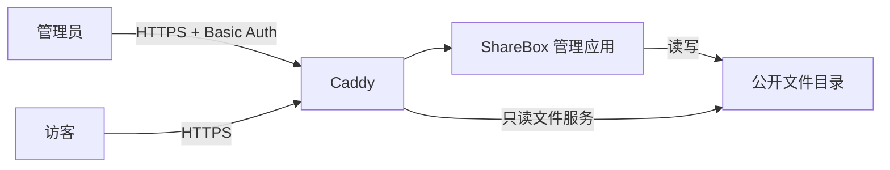

# ShareBox

ShareBox 是一个面向个人服务器的轻量文件管理与分享工具。管理员通过 React Router 管理页面上传、浏览和删除文件；公开文件可由 Caddy 直接提供目录浏览与下载。

当前仓库处于第一版开发阶段，重点是建立可用的管理界面和安全的本地文件树操作。产品边界见 [需求文档](docs/requirements.md)，目标部署方案见 [架构设计](docs/architecture.md)。

## 使用方法

部署完成后，通过管理域名访问 ShareBox，输入 Caddy 配置的用户名和密码：

1. 在文件树中浏览目录和文件。
2. 选择或拖放文件上传；上传过程中可以暂停、继续或重试。
3. 上传完成后，访客通过公开域名浏览和下载文件。
4. 删除文件或空目录时，在管理页面确认操作。

刷新页面后恢复未完成的上传，通常需要重新选择原文件。“移除记录”只移除已完成的上传记录，不会删除公开文件。


## Docker 单容器部署（推荐）

服务器只需安装 Docker，无需安装 Node.js、npm 或在宿主机运行构建。运行镜像基于 `node:24-alpine`，包含 Node.js 24、生产依赖、浏览器资源和 SSR 服务，以非 root 的 `node` 用户（UID/GID `1000:1000`）运行。Caddy 仍在宿主机通过系统包安装，负责 HTTPS 和认证；此方案只有 ShareBox 一个容器。

### 准备镜像

当前仓库提供 Dockerfile，尚未提供预构建镜像。先按照后面的[构建 Docker 镜像](#构建-docker-镜像)生成与服务器 CPU 架构匹配的 `sharebox:1.5.1` 镜像。服务器无需安装 Node.js 或 npm。

如果镜像是在其他机器构建并导出的，将压缩包传到服务器后导入：

```bash
docker load -i sharebox-image-1.5.1.tar.gz
```

### 启动容器

在服务器准备持久目录并启动：

```bash
sudo install -d -o 1000 -g 1000 -m 0755 /var/lib/sharebox

docker run -d \
  --name sharebox \
  --restart unless-stopped \
  --init \
  --env USER_URL=admin.example.com \
  --publish 127.0.0.1:8123:8123 \
  --mount type=bind,src=/var/lib/sharebox,dst=/var/lib/sharebox \
  sharebox:1.5.1
```

`USER_URL` 是必填的生产运行配置，替换为你的管理端主机名（不含协议或路径，例如 `admin.example.com`，非默认端口可写成 `admin.example.com:8443`）。它必须与 Caddy 管理地址一致。缺少或格式无效时应用会在启动时报错。

只需准备并挂载一个状态根目录，内部目录由程序在启动时创建和检查：

```text
/var/lib/sharebox/
├── data/              # 公开文件，Caddy 只读取这里
└── tmp/               # 私有目录，权限 0700
    ├── tus/           # 上传中的文件和断点元数据
    └── tus-receipts/  # 完成回执
```

程序不会清空已有内容，并会拒绝状态根目录及内部目录为符号链接或普通文件的情况。要使用其他宿主机存储位置，只需修改挂载的 `src`；容器内路径可以保持默认值。

上述目录权限示例适用于普通 rootful Docker、未启用 user namespace remapping 的 Linux 服务器；使用 rootless Docker 或 UID 映射时，需要按映射后的宿主机 UID/GID 设置写权限。已有数据迁移时，也需确保容器用户可读写已有文件，公开目录及文件可供 Caddy 读取。不要将 tmp 放入公开目录。挂载会覆盖镜像内根目录的权限，因此宿主机状态根目录必须允许容器用户创建和维护内部目录。

容器内监听 `0.0.0.0:8123`，宿主机只发布到 `127.0.0.1:8123`。配置 [Caddyfile.example](Caddyfile.example) 中的管理域名、认证信息和公开域名，即可沿用示例中的代理地址和公开文件路径。应用自身没有认证，正式使用前必须配置 Caddy 并保护全部管理接口，包括 `/uploads`。

可在 `docker run` 的镜像名称前添加 `-e MAX_UPLOAD_BYTES=...` 或 `-e LOGGER_LEVEL=debug` 覆盖运行配置。查看状态与日志：

```bash
docker ps --filter name=sharebox
docker logs --tail 100 sharebox
curl -I http://127.0.0.1:8123/
```

### 配置 Caddy

部署由 Caddy 和 ShareBox 管理应用组成：


```mermaid
flowchart LR
    Admin[管理员] -->|HTTPS + Basic Auth| Caddy[Caddy]
    Caddy --> App[ShareBox 管理应用]
    App -->|读写| Files[公开文件目录]
    Visitor[访客] -->|HTTPS| Caddy
    Caddy -->|只读文件服务| Files
```

容器内 Node.js 监听 `0.0.0.0`，宿主机端口仅发布到本机地址，由 Caddy 负责 HTTPS、管理端 Basic Auth、反向代理以及公开文件下载。不要把配置、密码、日志、临时文件或备份放入 `STATE_DIR/data`。Docker 只挂载一个状态根目录；程序维护公开文件目录和权限为 `0700` 的私有上传目录，公开文件供宿主机 Caddy 只读访问。

示例见 [Caddyfile.example](Caddyfile.example)：替换两个域名、用户名和密码哈希，确认公开端 root 指向宿主机状态根目录下的 `data/`，不要公开整个状态根目录。使用 `caddy hash-password` 交互生成哈希，然后运行：

```bash
caddy validate --config Caddyfile.example --adapter caddyfile
```

域名 DNS 应指向服务器，并使 Caddy 可用 HTTP/HTTPS 端口完成自动证书管理。容器运行时的 `USER_URL` 必须与管理域名一致，不含协议或路径。公开端直接读取数据目录，不代理至管理应用；`index ""` 使上传的 `index.html` 不会替代目录列表。不要通过服务器向公开目录放入符号链接，Caddy 可跟随它们访问目标。

Caddy 认证、HTTPS、公开浏览下载和管理应用停止后的下载能力已由部署者手动验证（2026-09-13）。

### 更新与备份

更新时先构建或导入新版本镜像，然后停止、删除旧容器，再使用新标签执行同一个 `docker run` 命令：

```bash
docker stop sharebox
docker rm sharebox
```

状态根目录中的公开文件、上传断点和完成回执会保留；不要删除状态目录，也不要让多个容器同时使用同一上传目录。保留旧镜像标签，若更新失败可删除新容器并用旧镜像重新启动。更新后需要手动检查启动日志和访问结果。备份应包含整个状态根目录；为取得一致的上传状态，可先停止容器再备份。

旧的 `DATA_DIR`、`UPLOAD_TMP_DIR` 配置不再支持，启动时会提示改用 `STATE_DIR`。已有 `/var/lib/sharebox/data` 和 `/var/lib/sharebox/tmp` 可直接保留；若曾使用其他路径，先停服务，再将公开文件和完整上传临时目录分别迁移到新状态根目录的 `data/` 和 `tmp/`，核对内容及权限后再启动。

若从原 systemd 部署切换，先备份数据，停止并禁用 `sharebox.service`，再调整持久目录和已有文件的 UID/GID；两种方式不能同时占用 `8123` 或同时操作同一上传目录。切换后由 Docker 重启策略管理应用。

## 配置

| 配置 | 必填 | 说明 |
| --- | --- | --- |
| `USER_URL` | 生产必填 | 管理端主机名（可包含端口），不含协议或路径；用于 React Router 页面 action 和应用写请求的来源检查，本地开发使用同源检查 |
| `STATE_DIR` | 否 | 覆盖状态根目录；未设置或为空时，由 `platformdirs` 选择当前用户的平台默认数据路径。程序创建并维护内部 `data/`、`tmp/tus/` 和 `tmp/tus-receipts/`，当前用户需有读写和访问权限 |
| `MAX_UPLOAD_BYTES` | 否 | 单文件大小上限，默认 `10737418240`（10 GiB），必须为正安全整数 |
| `LOGGER_LEVEL` | 否 | Pino 日志级别，默认 `info` |

默认使用 `platformdirs.userDataDir("sharebox", false)`，不按应用版本划分目录：

| 平台 | 默认状态根目录 |
| --- | --- |
| Linux | `$XDG_DATA_HOME/sharebox`，未设置时为 `~/.local/share/sharebox` |
| macOS | `~/Library/Application Support/sharebox` |
| Windows | `%LOCALAPPDATA%\sharebox` |

Docker 镜像显式设置 `STATE_DIR=/var/lib/sharebox`，因此前面的单目录挂载和 Caddy 路径保持一致。直接运行应用时，如果需要继续使用已有 `/var/lib/sharebox` 数据，应显式保留这个配置；省略配置会使用当前用户的平台数据目录。实际路径会记录在启动日志中。

应用以 JSON Lines 格式将启动、文件列表读取、上传、删除和相关错误日志直接写入标准输出，不创建日志文件。Docker 部署通过容器运行时采集日志，可用 `docker logs` 查看。

生产启动通过 `packages/server.mjs` 加载构建产物，将运行时 `USER_URL` 提供给 React Router 的 `allowedActionOrigins`；应用自己的写请求校验也读取运行时环境变量。修改管理域名后，用新的 `USER_URL` 重新创建容器并同步修改 Caddy 配置即可，无需重新构建镜像。`npm run start` 同样使用该启动模块，不要绕过它直接运行 `build/server/index.js`。

## 当前功能

- 在同一工作区浏览文件树和上传文件
- 展开、收起多级目录，支持鼠标与键盘操作
- 显示文件类型图标、文件大小和目录子项数量
- 选择或拖放多个文件，使用 tus 续传，显示每个文件的字节数与百分比
- 支持暂停、继续、失败重试和删除上传任务；刷新后重新选择原文件可续传
- 删除文件和空目录，操作前显示确认对话框
- 上传、删除或手动刷新后重新读取磁盘文件树
- 忽略符号链接，并限制删除目标位于配置的数据目录内
- 未捕获的路由和渲染异常通过全局弹窗提示，并支持重新加载
- 使用 MUI 组件、图标和响应式双栏布局

上传使用 `tus-js-client`、`@tus/server` 和 `@tus/file-store`，每个请求最多发送 8 MiB，数据流式写入公开目录之外。最后一次传输请求在 tus 完成钩子中自动复制发布，发布成功才显示“上传成功”，不再提供独立的 `/complete` 接口；复制期间可能公开不完整内容，进程被强制终止时可能留下残缺文件。同名文件、目录和符号链接均拒绝覆盖。新建目录、重命名、移动及复制公开链接不属于当前版本。

上传任务和断点保存在 `STATE_DIR/tmp/tus`，完成回执保存在 `STATE_DIR/tmp/tus-receipts`；任务从创建起保留 7 天，首次使用上传服务时及其后每小时清理过期数据。发布失败保留完整临时文件，客户端通过 HEAD 恢复时自动重试完成处理；只有发布成功或存在有效完成回执时才确认传输完成，避免误报成功或重新传输整个文件。暂停保留断点，“删除上传”清理临时数据，“移除记录”仅移除已完成的界面记录，不删除公开文件。浏览器记录不保存文件内容，刷新后通常需要重新选择同名、同大小且修改时间一致的原文件。

## 已知限制

- 支持向根目录上传，浏览器最多保留 100 个任务，同时传输最多 2 个文件，默认单文件上限 10 GiB
- 同名上传拒绝覆盖
- 当前为单 Node 进程、同源浏览器上传；不能让多个进程共享 tus 目录。反代必须保护 `/uploads` 的所有方法，允许 POST、HEAD、PATCH、DELETE，请求体限制至少容纳 8 MiB
- 每个分块仍受代理及 Node 请求超时约束；中断后通过 HEAD 查询已落盘偏移量重试，无需重传整个文件。未提供整文件 SHA-256 校验
- 复制发布不是事务：复制完成与写回执之间崩溃时，重试可能提示同名冲突，需要管理员检查公开文件；磁盘峰值需容纳临时文件和发布副本
- 旧 multipart action 暂时保留兼容，但新界面不再使用，旧接口不支持续传
- 只能删除文件或空目录
- 尚未实现新建目录、重命名、移动和复制公开链接
- 应用自身不提供认证，正式部署必须在反向代理层保护所有管理页面和写操作
- 文件列表直接来自磁盘，没有数据库、搜索、标签、预览或审计记录

## 从源码构建

### 本地开发

#### 环境要求

- Node.js 22.22.0 或更高版本
- npm
- 一个当前用户可创建和读写的状态根目录

#### 安装与运行

```bash
npm ci
npm run dev
```

开发服务器默认可通过 `http://localhost:5173` 访问。省略 `STATE_DIR` 时，程序自动创建平台默认数据目录及内部结构。也可指定绝对或相对路径，将开发数据保存在项目内：

```bash
STATE_DIR="$PWD/.local/sharebox" npm run dev
```

不要将私有目录放入公开文件目录。

使用上面的项目内路径时，可以先创建少量测试内容来查看多级文件树：

```bash
mkdir -p ./.local/sharebox/data/documents
printf 'Hello ShareBox\n' > ./.local/sharebox/data/documents/example.txt
```

### 构建与检查

| 命令 | 用途 |
| --- | --- |
| `npm run dev` | 启动带热更新的开发服务器 |
| `npm test` | 运行服务端与上传队列回归测试 |
| `npm run typecheck` | 生成路由类型并运行 TypeScript 检查 |
| `npm run build` | 构建客户端和 SSR 服务端产物 |
| `npm run start` | 通过 `packages/server.mjs` 加载生产构建及运行时管理域名 |

构建不需要管理域名；生产运行时才配置 `USER_URL`：

```bash
npm ci
npm run typecheck
npm run build
USER_URL=admin.example.com npm run start
```

构建输出位于 `build/client/`（浏览器资源）和 `build/server/`（Node.js SSR 服务）。服务器部署使用前面的 Docker 单容器方案。

### 构建 Docker 镜像

构建阶段使用 `node:24-bookworm-slim`；生产依赖在独立的 Alpine 阶段通过 `npm ci --omit=dev` 安装，避免将 Debian 环境安装的原生二进制依赖复制到 Alpine。最终镜像不包含构建工具和开发依赖。Alpine 使用 musl；以后新增原生模块时，需要确认其 musl 支持并验证容器运行。

Dockerfile 位于 `packages/Dockerfile`。在项目根目录构建镜像：

```bash
docker build --pull -f packages/Dockerfile -t sharebox:1.5.1 .
```

命令末尾的 `.` 表示使用项目根目录作为构建上下文，不要改为 `packages/`。

镜像不绑定管理域名；构建不需要 `USER_URL`，部署时通过 `docker run --env USER_URL=...` 指定。`.dockerignore` 仅允许必要的构建输入，排除宿主机 `.env`、本地数据、凭据和依赖目录。构建需要联网拉取基础镜像和 npm 依赖。

可以直接在服务器用源码构建，也可以在其他机器构建后导出镜像并传到服务器：

```bash
# 将镜像导出，随后把压缩包传到服务器
docker save sharebox:1.5.1 | gzip > sharebox-image-1.5.1.tar.gz
```

镜像必须匹配服务器 CPU 架构；例如在 ARM Mac 上为 x86_64 Linux 服务器构建时，构建命令增加 `--platform linux/amd64`。

## 技术栈

- Node.js、TypeScript
- React 19
- React Router Framework（SSR、loader/action、fetcher）
- Material UI 与 MUI X Tree View
- Pino 结构化日志
- Vite

## 项目结构

```text
app/
├── components/
│   ├── files/       # 文件浏览卡片、树节点和删除交互
│   ├── layout/      # 管理工作区页面布局
│   └── upload/      # 上传面板和拖放选择区
├── routes/          # React Router 路由、loader 和 action 入口
├── server/          # 文件系统操作、表单处理与运行配置
├── types/           # 前后端共享类型
├── utils/           # 通用格式化函数
├── root.tsx         # HTML 文档、主题 Provider 和错误边界
└── theme.ts         # MUI 主题
```

页面 loader 从磁盘读取文件树；上传通过同源 `/uploads` 资源路由传输，发布成功后主动重新验证 loader；公开文件删除仍通过 fetcher 提交。更细的文件职责见 [代码结构说明](docs/code-structure.md)。

## 文档

- [产品需求](docs/requirements.md)
- [架构设计](docs/architecture.md)
- [代码结构](docs/code-structure.md)
