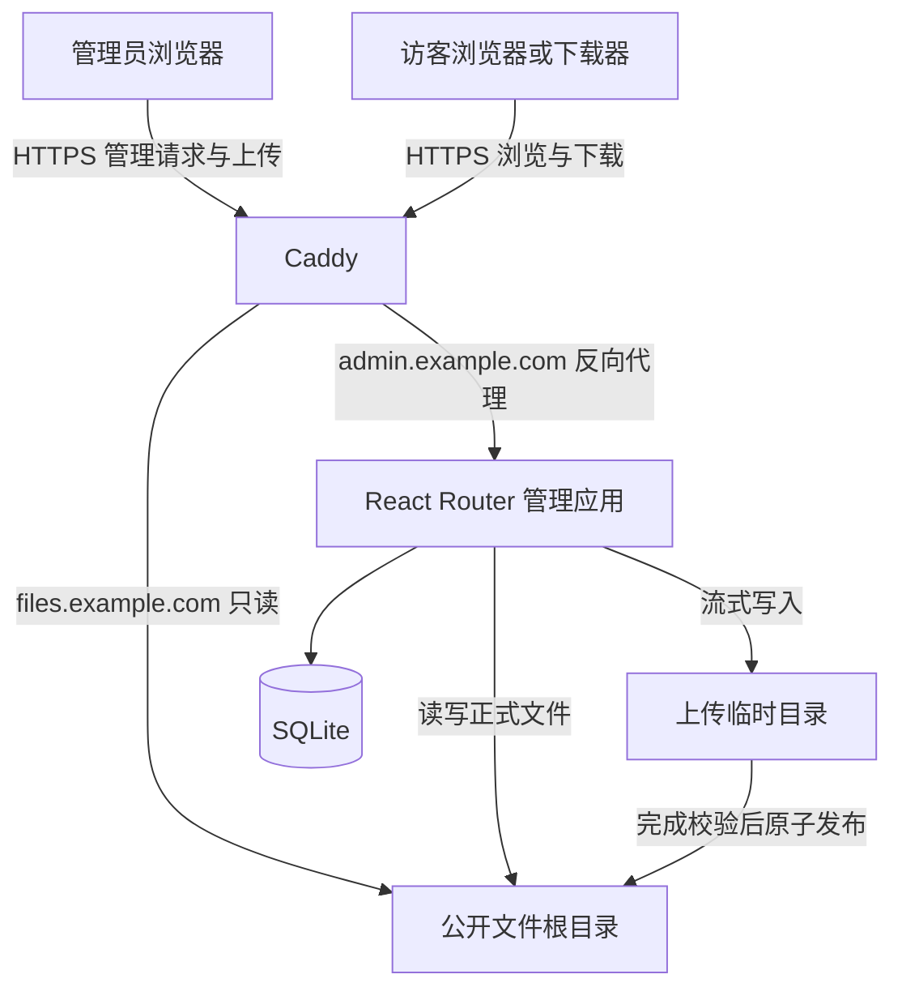

# ShareBox 架构设计

## 1. 设计基线

产品范围与验收标准见 [项目需求](requirements.md)。本文只描述实现结构、模块职责、数据流与技术约束。

公开下载使用 Caddy 是原讨论中已明确的选择。管理端采用 React Router Framework 是原讨论的推荐方向，本文以此作为架构草案基线，并未将其视为用户已经最终确认的选型。

| 组成 | 方案 | 职责 |
| --- | --- | --- |
| 管理应用 | TypeScript、React Router Framework、Node.js | 页面、服务端 loader/action、认证、文件管理 |
| 公开服务与入口 | Caddy | HTTPS、管理端反向代理、公开目录和文件传输 |
| 持久化 | SQLite；通过 Drizzle 管理应用数据 | 管理员与会话 |
| 文件存储 | Linux 本地文件系统 | 文件本体、目录结构和实时文件属性 |

第一版部署一个管理应用进程，不另设 Fastify 服务、独立 REST API、Redis 或任务队列。

管理应用需要保留服务端运行时，采用启用 SSR 的 Framework 模式。原讨论中“关闭 SSR 仍直接使用服务端 loader/action”的说法不适用于这里：`ssr: false` 的 SPA 模式没有请求时运行的框架服务端，数据操作应改用客户端 API 或另建后端。参见 [React Router SPA 模式](https://reactrouter.com/how-to/spa) 和 [预渲染约束](https://reactrouter.com/how-to/pre-rendering)。

## 2. 总体结构

管理应用和 Caddy 通过文件系统协作：应用修改正式文件后，Caddy 按请求读取，无需通知或重新加载文件索引。公开下载不查询 SQLite，也不经过 Node.js。

## 3. 模块职责

| 模块 | 职责与依赖 |
| --- | --- |
| 管理页面与路由 | 渲染页面、处理表单、调用服务，转换结果与错误；不直接拼接磁盘路径 |
| 认证服务 | 校验密码、创建与撤销会话、为每个受保护 loader/action 检查身份 |
| 文件管理服务 | 编排浏览、新建、重命名、移动、删除，控制名称冲突和写操作顺序 |
| 上传服务 | 解析 multipart 流、限制体积、处理临时文件、校验完成状态、调用存储模块发布 |
| 文件存储模块 | 统一相对路径校验、根目录约束、符号链接检查和实际文件系统操作 |
| 链接模块 | 根据公开站点基址及规范相对路径生成 URL，不创建 Token |
| 数据模块 | 封装 SQLite、Drizzle schema、迁移和账号/会话读写 |
| 配置模块 | 读取并校验域名、目录、上传限制、会话有效期与监听地址 |

模块是职责划分，不要求拆成多个服务或预设复杂源码目录结构。文件系统、数据库和密码处理逻辑仅放在服务端模块中，不进入浏览器构建。

## 4. 路由与页面协作

管理端以 `admin.example.com` 为独立来源。

| 路由 | 服务端入口 | 协作方式 |
| --- | --- | --- |
| `/` | loader | 根据登录状态重定向到 `/files` 或 `/login` |
| `/login` | loader、action | 展示登录页，提交凭据并创建会话 |
| `/logout` | POST action | 撤销会话并重定向到 `/login` |
| `/files?path=...` | loader、action | 读取当前目录；按 `intent` 分派新建目录、重命名、移动、删除 |
| `/upload` | POST resource action | 接收 multipart 文件流，返回上传与发布结果，无独立页面 |

`path` 使用相对公开根目录的路径，空字符串代表根目录。操作参数在服务端再次验证；不信任表单中的目标目录、文件名或浏览器 MIME 类型。

管理页通过表单或 fetcher 提交，成功后重新加载当前目录；重定向使用明确的页面 URL。上传响应只有在发布完成后才报告成功。

公开端 URL 直接映射文件相对路径，例如 `software/app.zip` 对应 `https://files.example.com/software/app.zip`。对各路径段分别进行 URL 编码，保留目录分隔符；路径变化意味着 URL 变化，不维护旧链接别名。

## 5. 存储与数据模型

### 5.1 文件系统是文件状态来源

列表与属性按请求读取目录和文件状态，不以数据库中的文件清单决定文件是否存在。返回页面的条目可以包含 `name`、`relativePath`、`type`、`size`、`modifiedAt` 和 `downloadUrl`。

| 存储位置示例 | 内容 | 管理应用 | Caddy 文件服务 |
| --- | --- | --- | --- |
| `/srv/sharebox/public` | 完整的公开文件和目录 | 读写 | 只读 |
| `/srv/sharebox/tmp` | 上传临时文件 | 读写 | 不可读 |
| `/var/lib/sharebox/sharebox.db` | 应用数据 | 读写 | 不可读 |

以上为运行时路径示例，均由配置提供。`public` 和 `tmp` 必须位于同一文件系统，以支持发布时的原子移动；启动时验证这一前提。数据库、日志、配置和备份不放入公开根目录。

### 5.2 SQLite 的最小范围

| 表 | 主要字段 | 用途 |
| --- | --- | --- |
| `users` | `id`、`username`（唯一）、`password_hash`、`created_at` | 单管理员账号；通过部署初始化 |
| `sessions` | `token_hash`、`user_id`、`expires_at`、`created_at` | 可过期、可撤销的服务端会话 |

Cookie 保存随机会话令牌，数据库仅保存令牌摘要。密码使用适合密码存储的加盐哈希。

第一版不建立 `files` 或 `shares` 表，也不保存 `public`、`download_count` 等尚无消费方的字段。以后确实需要描述或标签时，再增加以相对路径关联的元数据，并处理服务器外部改名导致的关联变化。

## 6. 关键流程

### 6.1 上传与发布

1. Caddy 将上传请求代理到管理应用；action 先检查会话与请求来源。
2. 验证目标目录、文件名和上传限制，生成不可预测的临时文件名。
3. multipart 内容以流方式写入 `tmp`，同时累计实际字节数；不把整个文件交给内存缓冲。
4. 请求中断、超限或写入失败时关闭流并清理临时文件，返回明确错误。
5. 内容写入完成并关闭文件后，在写操作临界区内重新检查目标路径和名称冲突，再原子发布到 `public`。
6. 发布成功后才返回成功，管理页刷新，公开链接立即可用于新请求。

普通 `rename` 在目标存在时可能覆盖文件，不能仅凭“原子”保证不覆盖。实现应使用不覆盖的原子发布能力，或在单进程串行写入约束下完成冲突检查与移动；后者要求外部写入不能并发修改相同目标。临时目录由应用独占，进程启动时清理上次中断遗留文件。

### 6.2 浏览、重命名、移动与删除

loader 经认证后读取当前目录，跳过不支持的符号链接及特殊文件。服务端对目录路径进行边界检查，目录不存在时返回可恢复的页面错误。

重命名和移动统一通过文件管理服务执行，拒绝目标冲突和根目录操作；第一版只移动普通文件。删除普通文件使用文件删除操作，删除目录仅允许空目录，不递归清空。文件变更无需同步文件数据库。

通过 SSH 等方式导入文件时，也应先在公开根之外完成写入，再发布；外部写入需与应用避免同一目标的并发变更，不能引入符号链接、特殊文件或敏感内容。

### 6.3 公开下载

访客请求公开路径，Caddy 读取磁盘并处理文件响应与 Range 请求。应用和数据库不参与此流程。文件删除或改名后，原路径的新请求返回 404；已打开的下载连接可能继续读取原文件，不构成撤回机制。

## 7. 安全边界与运行方式

- 每个受保护的 loader/action 独立调用认证检查，不能只依赖父页面跳转。写操作使用 POST，并检查请求来源或 CSRF Token。
- 会话 Cookie 设置 `HttpOnly`、`Secure` 和适当的 `SameSite`，限定管理域名，不设置跨子域共享的 `Domain`。登录增加失败尝试限速。
- 文件存储模块拒绝绝对路径、父目录穿越、NUL 和名称中的路径分隔符，检查每层路径及最终对象，不跟随符号链接。操作前重新验证目标，降低检查后路径被替换的风险。
- Caddy 与应用使用不同的非 root 用户。应用可以写公开目录，Caddy 仅具备目录遍历和文件读取权限，不能读取临时目录和应用数据。
- Caddy 的站点根目录不是操作系统沙箱，根内符号链接仍可能指向根外。必须结合文件权限和“公开树中无符号链接”的写入约束；隐藏列表条目不能替代访问控制。参见 [Caddy file_server](https://caddyserver.com/docs/caddyfile/directives/file_server)。
- 管理端与公开端使用不同来源，避免公开 HTML 内容运行在管理页面来源下。

第一版建议由 systemd 管理 `caddy` 和 `sharebox` 两个长期服务。Node.js 仅监听本机接口；SQLite 是嵌入式数据库，无需独立服务。配置至少包括管理端来源、公开端基址、文件根目录、临时目录、数据库路径、上传大小限制、会话有效期和监听地址。具体域名、限额和超时由部署环境确定。

Caddy 配置只需表达两条路由：管理域名反向代理到 Node.js，公开域名通过 `root` 和 `file_server browse` 提供文件。`browse` 默认只在没有索引文件时显示目录，因此实现时应关闭索引文件查找，以免上传的 `index.html` 或 `index.txt` 替代目录列表；该行为应纳入配置验证。参见 [Caddy 目录列表与索引规则](https://caddyserver.com/docs/caddyfile/directives/file_server)。

发布前验证 Caddy 配置与文件权限，执行需求文档中的验收场景，并检查大文件上传期间内存是否有界。备份覆盖公开文件、SQLite 一致性备份和必要配置，临时文件不纳入备份。本文件为设计草案，不代表服务已部署或验收已通过。

## 8. 扩展边界

未来增加独立调用方时，可在现有服务层之上增加 API；无需现在维护第二个后端。

私有分享需要重新设计下载授权链路。仅在 SQLite 增加密码或过期字段，无法限制 Caddy 直接暴露的公开文件；将鉴权请求重定向到永久公开地址也不能实现持续访问控制。出现该需求时再选择受保护的文件响应方案，并使私有文件始终位于公开根之外。
