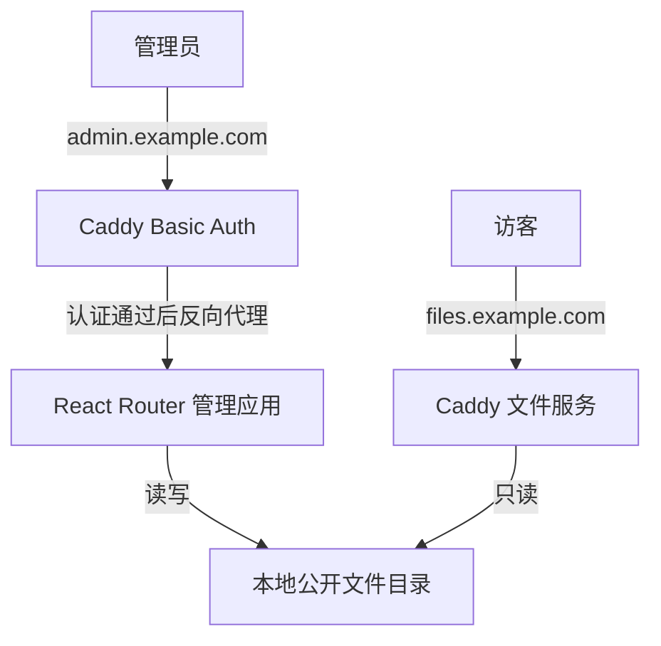

# ShareBox 第一版架构

## 1. 整体方案

第一版只运行 Caddy 和一个管理应用，文件直接存放在本地磁盘。产品功能见 [项目需求](requirements.md)。

| 组成 | 职责 |
| --- | --- |
| Caddy | HTTPS、管理端 Basic Auth 认证、反向代理、公开目录浏览和下载 |
| React Router Framework 管理应用 | 文件管理页面、上传、新建目录、重命名、移动、删除、复制链接 |
| 本地文件系统 | 保存文件，提供目录列表、大小和修改时间 |

不使用数据库，不实现应用账号、会话或独立 API 服务。React Router 沿用此前推荐方案，保留 Node.js 服务端运行时和 SSR，以使用服务端 loader/action。

## 2. 管理端认证

Caddy 对管理域名的全部请求启用 `basic_auth`，覆盖页面、上传和所有写操作。浏览器负责显示认证提示，Caddy 校验凭据后才反向代理到应用。公开域名不配置认证。

用户名和密码哈希写在 Caddy 配置中，使用 `caddy hash-password` 生成哈希。应用不保存密码，不提供登录页、退出接口或会话管理。Basic Auth 凭据可能被浏览器缓存，不承诺应用级退出能力。认证行为与配置见 [Caddy basic_auth 文档](https://caddyserver.com/docs/caddyfile/directives/basic_auth)。

应用只监听 `127.0.0.1`，不向公网开放端口，确保外部请求必须经过 Caddy。写操作使用 POST，并由应用检查 `Origin` 与配置的管理端来源一致，拒绝不匹配或缺失的来源，防止浏览器自动携带凭据造成跨站写入。

## 3. 应用结构

应用内只保留两部分，不再拆分认证、上传、链接、数据等独立模块：

- **页面与路由**：一个文件管理页；loader 读取当前目录，action 处理表单与上传，完成后刷新列表。
- **文件操作函数**：统一处理路径校验、读取目录、上传落盘、新建目录、重命名、移动、删除和生成公开 URL。

文件列表直接读取磁盘，无需同步数据库。公开 URL 由公开域名与按段编码的相对路径组成；文件移动或改名后链接随之改变。

## 4. 文件与请求流程

只需要两个数据目录，实际路径可配置：

| 目录示例 | 用途 |
| --- | --- |
| `/srv/sharebox/public` | 完整文件，应用可读写，Caddy 只读 |
| `/srv/sharebox/tmp` | 上传中的临时文件，只有应用可访问 |

**上传**：浏览器 → Caddy 认证 → 应用流式写入临时目录 → 完成校验 → 原子发布到公开目录 → 返回成功。两个目录放在同一文件系统；失败时清理临时文件，不能暴露半成品。

**整理**：浏览器 → Caddy 认证 → 应用检查路径和名称冲突 → 执行文件操作 → 刷新目录。第一版拒绝同名覆盖，只删除空目录；写操作串行处理，外部导入避免并发修改相同目标。

**下载**：访客 → Caddy → 公开目录。文件内容不经过应用；管理应用停止后，已有文件仍可下载。

## 5. 必要约束

- 文件操作限制在公开根目录内，拒绝路径穿越和符号链接；公开树中也不允许外部导入符号链接。
- 上传设置大小限制并采用流式写入。同名检查与发布需防止并发覆盖，不能仅依赖普通 `rename`。
- Caddy 和应用以非 root 用户运行；Caddy 无权写公开文件或读取临时目录。配置、密码哈希、日志和备份放在公开目录之外。
- 管理端与公开端使用不同域名并启用 HTTPS。
- Caddy 使用 `file_server browse`；配置时关闭索引文件查找，避免上传的 `index.html` 替代目录列表。文件服务规则见 [Caddy file_server 文档](https://caddyserver.com/docs/caddyfile/directives/file_server)。

实现后按需求文档验收，重点验证认证覆盖所有管理入口、上传失败不公开残缺文件、文件操作不越界，以及下载独立于管理应用。本次只调整设计文档，不包含实际部署。
