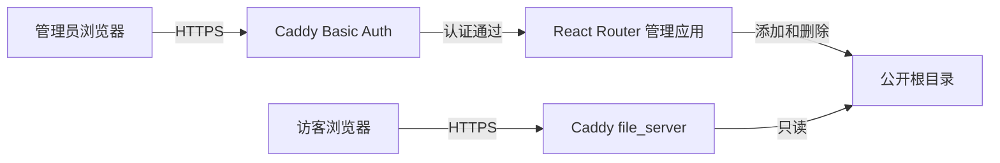

# ShareBox 架构设计

## 1. 设计范围

本文只描述 [当前版本需求](requirements.md#2-当前版本) 的实现，不为后续功能预设模块或数据结构。

当前版本由 Caddy、一个 React Router Framework 管理应用和本地文件系统组成。不使用数据库、应用账号、会话、独立 API 服务或任务队列。

## 2. 组件职责

| 组件 | 职责 |
| --- | --- |
| Caddy | HTTPS、管理端 Basic Auth、反向代理、公开文件列表与下载 |
| React Router Framework 应用 | 渲染单页文件管理界面，读取、上传和删除文件 |
| 本地文件系统 | 保存文件，并作为文件列表的唯一数据来源 |

管理应用使用 Node.js 和 TypeScript，界面使用 React Router Framework 与 MUI。应用保留服务端运行时和 SSR，服务端 `loader` 读取文件列表，`action` 处理上传和删除。

## 3. 路由和请求处理

管理端只需要一个页面路由 `/`：

- `loader` 递归读取公开根目录中的文件和目录，返回文件名、相对路径、文件大小和子节点。
- 页面使用 MUI 目录树、文件选择和拖放区域、上传按钮及删除确认对话框。
- `action` 根据表单中的 `intent` 执行 `upload` 或 `remove`。
- 操作成功后由 React Router 重新验证 loader，刷新文件列表。

上传组件使用文件选择框或拖放取得单个文件，以 `FormData` 和 `fetcher.submit` 提交 `intent=upload`、`file`。请求方法为 POST，编码为 `multipart/form-data`。提交期间显示不定进度指示，不实现百分比进度、分片或独立上传接口。

删除使用 POST 提交 `intent=remove` 和相对路径 `path`。确认后才提交，取消保持文件不变。操作成功后由 React Router 重新验证 loader。

## 4. 文件存储

配置两个目录，且两者位于同一个文件系统：

| 目录示例 | 用途 |
| --- | --- |
| `/var/lib/sharebox/data` | 已完整上传、可公开下载的普通文件 |
| `/var/lib/sharebox/tmp` | 上传中的临时文件，Caddy 不可访问 |

公开根目录允许多级目录和普通文件。loader 忽略符号链接和特殊文件；删除拒绝路径穿越、符号链接和非空目录。上传只写入根目录，不接收目录上传。

### 上传流程

1. Caddy 验证 Basic Auth 后，将表单请求代理到管理应用。
2. action 校验来源、文件名和大小限制。
3. Busboy 流式解析表单，通过带背压的管道写入私有随机临时目录中的文件；同时检查文件字节数、表单字段和文件数量。
4. 等待整个表单解析和文件写入完成，确认 intent、文件名、单文件数量和大小都有效。
5. 使用 `copyFile(COPYFILE_EXCL)` 将完整临时文件复制到公开根目录，支持跨挂载点；复制完成后才清理临时文件。目标已存在时直接失败，包括同名文件、目录和符号链接；并发上传也不会覆盖。
6. 成功或失败均移除该次上传的临时目录，不修改已有同名文件。清理失败记录错误日志；复制失败时由 Node.js 尝试删除本次复制的目标文件。复制期间公开目录可能出现不完整文件；进程被强制终止或清理失败时可能留下残缺文件和私有临时文件。

### 删除流程

1. Caddy 验证 Basic Auth 后，将删除表单提交给管理应用。
2. action 校验来源和相对路径，逐级检查目标位于公开根目录内且不是符号链接，允许普通文件或空目录。
3. 删除目标文件或空目录并返回结果，React Router 随后刷新列表。

公开下载不经过管理应用。Caddy 直接从公开根目录读取文件，因此管理应用停止不会影响已有文件的下载。

## 5. 安全与运行约束

- Caddy 对管理域名下的全部请求应用 `basic_auth`；公开域名不认证。
- Basic Auth 密码使用 `caddy hash-password` 生成哈希，配置中不保存明文密码。
- 部署脚本默认监听 `127.0.0.1:8123`，以非 root 用户运行；公开目录和文件权限默认分别为 `0755`、`0644`，供独立的 Caddy 用户读取。这些是部署默认值，不是产品验收约束。
- action 只接受 POST，并要求 `Origin` 存在且与构建时 `USER_URL` 对应的 HTTPS 来源一致。本地开发时与请求 URL 的来源比较；生产域名在构建时固定。React Router 的 `allowedActionOrigins` 仍保留。
- 文件名必须是单个名称，拒绝绝对路径、路径分隔符、父目录引用、NUL、空名称及保留名称（`.`、`..`）。
- 上传不覆盖任何已有目录项，因此不会写入同名符号链接的目标；读取和删除逐级检查符号链接。
- 同名文件一律拒绝。上传发布必须避免检查与发布之间的并发覆盖。
- Caddy 使用 `file_server browse` 提供公开文件列表，并以 `index ""` 禁用默认索引文件，避免名为 `index.html` 的上传文件替代列表页。

运行时只需 `caddy` 和 `sharebox` 两个服务。配置包含管理端域名、公开端域名、应用监听地址、公开目录、临时目录和上传大小限制。

## 6. 配置与部署验证

- `DATA_DIR`：已存在的数据根目录。
- `UPLOAD_TMP_DIR`：私有上传临时目录，默认 `<DATA_DIR 的真实路径>.tmp`；不能与公开目录重叠，可位于不同文件系统。部署脚本配置为 `/var/lib/sharebox/tmp`，并加入 systemd 可写路径。
- `MAX_UPLOAD_BYTES`：单文件最大字节数，默认 `1073741824`（1 GiB），必须为正安全整数。部署时可用 `SHAREBOX_MAX_UPLOAD_BYTES` 设置。表单总字节数另限为文件上限加 64 KiB，文本字段限为 4 KiB。
- `USER_URL`：构建时管理端主机名，不含协议和路径；修改后重新构建。
- `LOGGER_LEVEL`：日志级别，默认 `info`。日志写入标准输出。

示例见 [`Caddyfile.example`](../Caddyfile.example)。替换域名、用户名和 `caddy hash-password` 生成的密码哈希；公开域名的 root 与 DATA_DIR 一致。配置、日志、备份和临时文件均放在公开目录之外；不要通过服务器手动向公开目录放入符号链接，因为 Caddy 的文件根目录本身不是符号链接沙箱。

Caddy 认证、双域名 HTTPS、匿名公开浏览下载和管理应用停止后的下载能力，已由部署者于 2026-09-13 确认手动验证。示例配置及其替换说明参考 [Caddy file_server 文档](https://caddyserver.com/docs/caddyfile/directives/file_server)。
