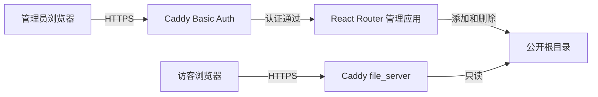

# ShareBox 架构设计

## 1. 设计范围

本文只描述 [当前版本需求](requirements.md#2-当前版本) 的实现，不为后续功能预设模块或数据结构。

当前版本由 Caddy、一个 React Router Framework 管理应用和本地文件系统组成。不使用数据库、应用账号、会话、独立 API 服务或任务队列。



## 2. 组件职责

| 组件 | 职责 |
| --- | --- |
| Caddy | HTTPS、管理端 Basic Auth、反向代理、公开文件列表与下载 |
| React Router Framework 应用 | 渲染单页文件管理界面，读取、上传和删除文件 |
| 本地文件系统 | 保存文件，并作为文件列表的唯一数据来源 |

管理应用使用 Node.js 和 TypeScript，界面使用 React Router Framework 与 MUI。应用保留服务端运行时和 SSR，服务端 `loader` 读取文件列表，`action` 处理上传和删除。

## 3. 路由和请求处理

管理端只需要一个页面路由 `/`：

- `loader` 读取公开根目录中的普通文件，返回文件名和大小。
- 页面使用 MUI 展示单层列表、基础文件选择表单和删除按钮。
- `action` 根据表单中的 `intent` 执行 `upload` 或 `delete`。
- 操作成功后由 React Router 重新验证 loader，刷新文件列表。

上传表单使用浏览器原生的 `multipart/form-data`：

```html
<form method="post" enctype="multipart/form-data">
  <input type="hidden" name="intent" value="upload" />
  <input type="file" name="file" required />
  <button type="submit">上传</button>
</form>
```

不实现拖放区域、前端文件分片、上传进度或单独的上传接口。删除使用 POST 表单并携带 `intent=delete` 和文件名，界面在提交前显示确认提示。

## 4. 文件存储

配置两个目录，且两者位于同一个文件系统：

| 目录示例 | 用途 |
| --- | --- |
| `/srv/sharebox/public` | 已完整上传、可公开下载的普通文件 |
| `/srv/sharebox/tmp` | 上传中的临时文件，Caddy 不可访问 |

公开根目录只允许一层普通文件。loader 忽略目录、符号链接和特殊文件；应用也拒绝创建或操作这些对象。

### 上传流程

1. Caddy 验证 Basic Auth 后，将表单请求代理到管理应用。
2. action 校验来源、文件名和大小限制。
3. 应用以流方式将文件写入随机命名的临时文件。
4. 写入完成后再次检查公开目录中不存在同名文件。
5. 将临时文件原子移动到公开根目录，成功后返回操作结果。
6. 任一步骤失败都清理临时文件，不修改已有同名文件。

### 删除流程

1. Caddy 验证 Basic Auth 后，将删除表单提交给管理应用。
2. action 校验来源和文件名，确认目标是公开根目录内的普通文件。
3. 删除目标文件并返回结果，React Router 随后刷新列表。

公开下载不经过管理应用。Caddy 直接从公开根目录读取文件，因此管理应用停止不会影响已有文件的下载。

## 5. 安全与运行约束

- Caddy 对管理域名下的全部请求应用 `basic_auth`；公开域名不认证。
- Basic Auth 密码使用 `caddy hash-password` 生成哈希，配置中不保存明文密码。
- 管理应用只监听 `127.0.0.1`，不能从公网绕过 Caddy 访问。
- action 只接受 POST，并检查 `Origin` 与管理端来源一致。
- 文件名必须是单个名称，拒绝绝对路径、路径分隔符、父目录引用、NUL、空名称和保留名称。
- 文件操作不跟随符号链接；执行前检查目标仍是公开根目录内的普通文件。
- 同名文件一律拒绝。上传发布必须避免检查与移动之间的并发覆盖。
- Caddy 和管理应用均以非 root 用户运行；应用可读写公开目录，Caddy 仅可读取公开目录。
- Caddy 使用 `file_server browse` 提供公开文件列表，并关闭索引文件查找，避免名为 `index.html` 的上传文件替代列表页。

运行时只需 `caddy` 和 `sharebox` 两个服务。配置包含管理端域名、公开端域名、应用监听地址、公开目录、临时目录和上传大小限制。
