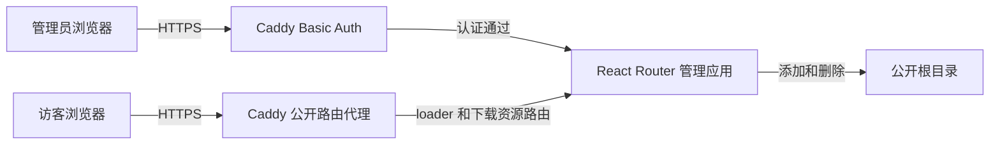

# ShareBox 架构设计

## 1. 设计范围

本文只描述 [当前版本需求](requirements.md#2-当前版本) 的实现，不为后续功能预设模块或数据结构。

当前版本由 Caddy、一个 React Router Framework 管理应用和本地文件系统组成。不使用数据库、应用账号、会话、独立 API 服务或任务队列。

```mermaid
flowchart LR
    Admin[管理员浏览器] -->|HTTPS| Auth[Caddy Basic Auth]
    Auth -->|认证通过| App[React Router 管理应用]
    App -->|添加和删除| Files[公开根目录]
    Visitor[访客浏览器] -->|HTTPS| Public[Caddy 公开路由代理]
    Public -->|loader 和下载资源路由| App
```

## 2. 组件职责

| 组件 | 职责 |
| --- | --- |
| Caddy | HTTPS、管理端 Basic Auth、公开路由与管理路由反向代理 |
| React Router Framework 应用 | 渲染管理和公开界面，读取、上传、删除文件与流式下载 |
| 本地文件系统 | 保存文件，并作为文件列表的唯一数据来源 |

管理应用使用 Node.js 和 TypeScript，界面使用 React Router Framework 与 MUI。应用保留服务端运行时和 SSR，服务端 `loader` 读取文件列表，`action` 处理上传和删除。

## 3. 路由和请求处理

管理页面路由 `/`：

- `loader` 递归读取公开根目录中的文件和目录，返回文件名、相对路径、文件大小和子节点。
- 页面使用 MUI 目录树、文件选择和拖放区域、上传按钮及删除确认对话框。
- `action` 根据表单中的 `intent` 执行 `remove`。
- 操作成功后由 React Router 重新验证 loader，刷新文件列表。

上传组件使用 `tus-js-client`，每个 PATCH 最多 8 MiB，同时传输最多 2 个文件。资源路由 `/uploads/*` 转交 `@tus/server.handleWeb`，POST 创建任务，HEAD 查询已落盘偏移，PATCH 续传，DELETE 终止。全部在管理端同源认证边界内，不提供跨源客户端支持。`UploadService` 通过 `onUploadFinish` 在成功响应前自动发布；前端仅在 tus `onSuccess` 后调用 revalidator，不再发送独立的 complete 请求。浏览器保存任务元数据，不保存文件内容，刷新后重新选择原文件即可恢复。字节进度到 100% 但响应尚未返回时显示“正在完成”；旧的 publishing/transferred 本地记录恢复为普通暂停任务。

删除使用 POST 提交 `intent=remove` 和相对路径 `path`。确认后才提交，取消保持文件不变。操作成功后由 React Router 重新验证 loader。

## 4. 文件存储

`STATE_DIR` 可选，用于覆盖唯一的状态根目录；未设置或为空时，通过 `platformdirs.userDataDir("sharebox", false)` 使用当前用户的平台默认数据路径，不带版本子目录。程序在启动时创建和检查内部目录。Docker 镜像显式设置 `/var/lib/sharebox` 并挂载整个根目录：

| 目录示例 | 用途 |
| --- | --- |
| `/var/lib/sharebox/data` | 已完整上传、可公开下载的普通文件 |
| `/var/lib/sharebox/tmp` | 上传中的临时文件，Caddy 不可访问 |

公开根目录允许多级目录和普通文件。loader 忽略符号链接和特殊文件；删除拒绝路径穿越、符号链接和非空目录。上传只写入根目录，不接收目录上传。

### 上传流程

1. Caddy 对全部上传请求验证 Basic Auth，应用验证来源、文件名和声明大小。
2. FileStore 在 `STATE_DIR/tmp/tus` 保存随机 ID 命名的数据和 JSON 元数据。PATCH 流式追加；偏移不一致返回 409，客户端 HEAD 后重试。
3. 前端显示发送进度，暂停通过 abort 终止当前请求但保留任务。恢复时以服务器磁盘偏移为准。删除上传调用 tus DELETE，服务端清理数据与元数据。
4. 最后一次 PATCH（零字节文件为创建 POST）调用 `onUploadFinish`。钩子重新获取与 tus 共用的任务锁，检查实际长度，执行 `copyFile(COPYFILE_EXCL)`，跨文件系统自动发布且禁止覆盖。钩子返回前不向客户端确认成功。
5. 发布成功后在 `STATE_DIR/tmp/tus-receipts` 保存包含文件名和大小的小型完成回执（先写临时记录再重命名）。等 tus 请求处理结束后清理临时数据，避免零字节 POST 的后续读取失败。HEAD 在返回前检查完成状态：已传完但尚未发布时自动重试完成处理，失败返回错误且不返回完成偏移；存在回执时即使源文件已清理也返回完成偏移，支持重启及最后响应丢失后的恢复。客户端拦截非 404/410 的 HEAD 错误，防止 tus 自动另建任务。
6. 上传任务从创建起保留 7 天，首次访问及之后每小时清理，清理跳过正在持锁或正在创建的任务。回执从写入起保留 7 天。来源、路径、元数据、回执校验以及过期判断和响应头转换由类外纯函数完成（时间显式传入）；目录准备、复制和回执读写由类外无实例状态的 I/O 函数完成，调用位置仍受共享锁保护。服务实例持有 FileStore、Server、共享锁及定时器；清理任务不重叠执行，`dispose()` 释放定时器并等待清理结束。初始化失败会清空失败的 Promise，允许下次请求重试。只支持单个 Node 进程，进程内锁不能用于多实例共享目录。

复制发布继续沿用非原子契约：复制期间公开文件可能不完整，强制终止可能留下残缺文件；复制成功但回执落盘前崩溃时，重试会报告同名冲突，需人工核对。没有整文件哈希校验。短块请求避免整个大文件共用 5 分钟接收窗口，但每个请求仍受 Node/代理超时约束，中断可续传。

### 删除流程

1. Caddy 验证 Basic Auth 后，将删除表单提交给管理应用。
2. action 校验来源和相对路径，逐级检查目标位于公开根目录内且不是符号链接，允许普通文件或空目录。
3. 删除目标文件或空目录并返回结果，React Router 随后刷新列表。

公开页面 `/public` 使用独立 loader 调用 `readPublicDirectory`，仅扫描当前目录并返回名称、相对路径、类型、大小、修改时间和同源下载地址。路径存入 `?path=`，刷新和分享页面地址可以恢复目录。筛选与排序在当前目录数据上执行。公开页不提供写操作，错误边界不返回内部路径或异常详情。

资源路由 `/public/download` 调用 `downloadPublicFile`，逐级检查路径和符号链接，以 `O_NOFOLLOW` 打开普通文件，通过文件句柄流式读取，设置附件文件名、长度、Last-Modified 和 Accept-Ranges。支持单段、开放尾端和后缀 Range；不可满足的范围返回 416，多段范围退回完整响应；If-Range 日期不匹配时返回完整内容。HEAD 和空文件不创建数据流。请求取消及流关闭释放文件句柄；列表/下载请求边界与传输错误记录日志。读取模块复用根目录检查，管理端递归文件树契约保持不变。与既有文件操作相同，路径检查与打开之间仍存在并发替换父目录的竞态，不能作为针对本机恶意目录修改者的文件系统沙箱。

单域名下，Caddy 优先匿名代理 `/public`、`/public/*`、`/public.data`、构建静态资源、图标和路由发现 `/__manifest`，其余路由全部使用 Basic Auth，包括 `/`、`/index.data` 和上传接口。公开页与文件下载依赖应用运行，Caddy 不直接读取文件目录。

管理页使用相对地址 `/public` 作为入口；点击生成链接时根据浏览器 `window.location.origin` 生成文件完整下载地址，确保反向代理后仍使用浏览器看到的 HTTPS 域名。地址由共用的 `publicDownloadUrl` 编码相对路径，不新增链接服务或持久化记录。点击“生成下载链接”显示只读地址，复制成功或剪贴板不可用时显示反馈。公开列表整行是链接：目录使用 Framework 导航，文件使用原生文档请求触发下载；不嵌套按钮，支持键盘操作。

## 5. 安全与运行约束

- Caddy 在同域名内按路由区分认证：仅明确列出的公开入口不认证，其余请求应用 `basic_auth`。
- Basic Auth 密码使用 `caddy hash-password` 生成哈希，配置中不保存明文密码。
- Docker 镜像以非 root 用户运行，容器内监听 `0.0.0.0:8123`，部署命令仅将端口发布到宿主机 `127.0.0.1:8123`；公开目录和文件权限分别采用 `0755`、`0644`，供独立的 Caddy 用户读取。这些是部署默认值，不是产品验收约束。
- 删除 action 只接受 POST；上传资源支持 POST/HEAD/PATCH/DELETE。写请求要求 `Origin` 存在且与运行时 `USER_URL` 对应的 HTTPS 来源一致。本地开发时与请求 URL 的来源比较；生产域名在启动时读取，缺少或格式无效时拒绝启动。`packages/server.mjs` 将同一个运行时域名提供给 React Router 的 `allowedActionOrigins`。
- 文件名必须是单个名称，拒绝绝对路径、路径分隔符、父目录引用、NUL、空名称及保留名称（`.`、`..`）。
- 上传不覆盖任何已有目录项，因此不会写入同名符号链接的目标；读取和删除逐级检查符号链接。
- 同名文件一律拒绝。上传发布必须避免检查与发布之间的并发覆盖。
- 文件内容经下载资源路由以附件响应，上传的 `index.html` 不会替代公开页。

运行时只需 `caddy` 和 `sharebox` 两个服务。配置包含站点域名、应用监听地址、状态根目录和上传大小限制。

## 6. 配置与部署验证

- `STATE_DIR`：可选的状态根目录覆盖项；未设置或为空时使用 `platformdirs` 提供的平台默认用户数据路径（Linux 为 `$XDG_DATA_HOME/sharebox` 或 `~/.local/share/sharebox`，macOS 为 `~/Library/Application Support/sharebox`，Windows 为 `%LOCALAPPDATA%\sharebox`）。Docker 镜像显式设置为 `/var/lib/sharebox`；程序创建并维护 `data/`、`tmp/tus/` 和 `tmp/tus-receipts/`，保留已有文件，拒绝符号链接和非目录路径，将私有目录权限设为 `0700`。旧的 `DATA_DIR`、`UPLOAD_TMP_DIR` 配置被忽略。应用配置和日志模块仅读取进程环境变量，不主动加载 `.env` 文件。
- `MAX_UPLOAD_BYTES`：单文件最大字节数，默认 `10737418240`（10 GiB），必须为正安全整数。Docker 部署时可用 `-e MAX_UPLOAD_BYTES=...` 设置。表单总字节数另限为（单文件上限加 64 KiB）× 100，最多为 JavaScript 最大安全整数，文本字段限为 4 KiB。
- `USER_URL`：生产运行时必填的管理端主机名，可包含非默认端口，不含协议和路径；修改后重启应用或重新创建容器，无需重新构建镜像。本地开发使用请求 URL 的同源检查。
- `LOGGER_LEVEL`：日志级别，默认 `info`。日志写入标准输出。应用保持 Pino JSON 输出；`npm run dev` 在启动命令后通过 `| pino-pretty` 美化标准输出，`pino-pretty` 仅作为开发依赖安装，生产启动不使用该管道。

示例见 [`Caddyfile.example`](../Caddyfile.example)。替换域名、用户名和 `caddy hash-password` 生成的密码哈希；仅代理明确列出的公开路由，其余路由均要求认证。配置、日志、备份和临时文件均放在公开目录之外；不要通过服务器手动向公开目录放入符号链接。

历史双域名和 Caddy 直接文件服务部署曾于 2026-09-13 由部署者确认验证；当前单域名代理配置尚需部署验证。
